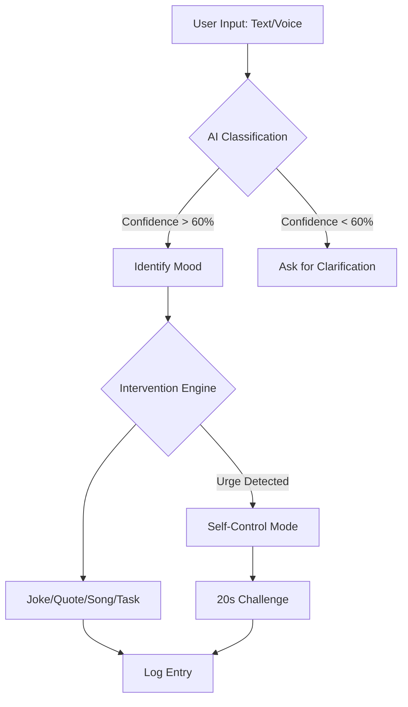
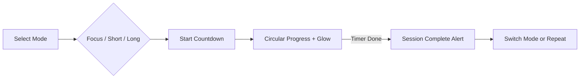
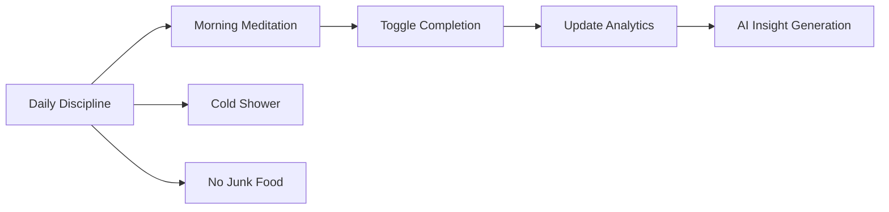

# MindShift AI 🧠
### AI-Powered Personal Mood Companion

MindShift AI is a sophisticated emotional intelligence platform designed to help users track, understand, and regulate their moods in real-time. By leveraging the power of Gemini AI, MindShift AI provides personalized interventions, deep emotional analytics, a structured discipline engine, and a premium Focus Timer to help you maintain your "Flow."

---

## 🚀 Features

- **Multimodal Mood Detection**: Express yourself via text or voice. Our AI classifies your state across 12 distinct emotional categories.
- **AI-Powered Interventions**: Receive personalized jokes, quotes, tasks, or Hindi song recommendations (YouTube integrated) based on your current vibe.
- **Self-Control Mode**: A specialized 20-second psychological challenge to manage intense urges (Anger, Procrastination, etc.) with streak tracking.
- **Deep Flow Timer**: A premium glassmorphic Pomodoro-style focus timer with three modes:
  - 🎯 **Focus** (25 min) — Deep work sessions with animated circular progress.
  - ☕ **Short Break** (5 min) — Quick recharge.
  - 🌙 **Long Break** (15 min) — Extended rest after multiple sessions.
- **Daily Discipline Engine**: A built-in habit tracker for essential routines like meditation and cold showers.
- **Bento Analytics Dashboard**: Visualize your emotional trends, productivity scores, and discipline indices with beautiful charts.
- **AI Insights Engine**: Long-term pattern detection that identifies your emotional cycles and provides actionable life advice.
- **Privacy-First Logging**: Local-first logging with auto-cleanup rules and data management.

---

## 🛠️ Tech Stack

- **Frontend**: React 19 + Vite
- **AI Engine**: Google Gemini Flash (via `@google/genai`)
- **Styling**: Tailwind CSS v4
- **Animations**: Motion (formerly Framer Motion)
- **Charts**: Recharts (D3-based React charts)
- **Icons**: Lucide React
- **Voice**: Web Speech API

---

## 📐 High-Level Architecture

MindShift AI is built with a modular service-oriented architecture:

- **Classification Layer**: Processes raw text/voice into emotional labels.
- **Intervention Layer**: Generates contextual content using generative AI.
- **Timer Layer**: Self-contained Pomodoro engine with mode-aware state management.
- **Persistence Layer**: Manages local state and historical logs.
- **Analytics Layer**: Aggregates data for trend visualization and insight generation.

### 🔄 Mood Detection to Intervention Flow



### ⏱️ Focus Timer Flow



### 🧘 Daily Discipline & Habit Logic



---

## 📅 Development Flow (11 Phases)

1.  **Phase 1**: Project Definition & Environment Setup.
2.  **Phase 2**: Mood Classification Engine (Gemini Integration).
3.  **Phase 3**: Voice-to-Mood Integration (Web Speech API).
4.  **Phase 4**: Content Generation Module (Personalized Interventions).
5.  **Phase 5**: Self-Control Mode (Psychological 20s Challenge).
6.  **Phase 6**: Hindi Song Integration (YouTube Search Mapping).
7.  **Phase 7**: Mood Analytics Dashboard (Recharts Visualization).
8.  **Phase 8**: Logging & Behavior Tracking System.
9.  **Phase 9**: Daily Discipline Engine & Habit Tracking.
10. **Phase 10**: Deep Flow Focus Timer (Glassmorphic Pomodoro).
11. **Phase 11**: Final App Integration & Professional Refactoring.

---

## 📂 Folder Structure

```text
/src
  /components
    /home         # HabitTracker, MoodInput, InterventionView, FocusTimer
    /stats        # AnalyticsDashboard
    /settings     # SettingsView
    /layout       # Navigation
  /services       # geminiService, analyticsService
  /lib            # Shared utilities (cn helper)
  /types.ts       # Global interfaces
  /constants.tsx  # Mood/Habit configurations
  /App.tsx        # Main Orchestrator
  /main.tsx       # Entry Point
```

---

## ⚙️ Setup & Installation

1.  **Clone the Repository**:
    ```bash
    git clone https://github.com/vanshbhardwaj22/mindshift-ai.git
    cd mindshift-ai
    ```

2.  **Install Dependencies**:
    ```bash
    npm install
    ```

3.  **Environment Variables**:
    Create a `.env` file in the root and add your Gemini API Key:
    ```env
    GEMINI_API_KEY=your_api_key_here
    ```

4.  **Run Development Server**:
    ```bash
    npm run dev
    ```

---

## 🌐 Live Demo

**Deployed on Vercel**: [mindshift-ai-gamma.vercel.app](https://mindshift-ai-gamma.vercel.app)

---

## 📖 Usage Guide

1.  **Morning Routine**: Start your day by checking off your "Daily Discipline" habits.
2.  **Focus Session**: Use the **Deep Flow Timer** to start a 25-minute focus session. Switch to Short/Long break as needed.
3.  **Mood Logging**: When you feel a shift in your "Flow," select a mood icon or click the microphone to speak your thoughts.
4.  **Intervention**: Follow the AI's suggestion. If it's a song, click the action button to open it on YouTube.
5.  **Self-Control**: If you're struggling with an urge, enter the 20s challenge and focus on the alternative actions provided.
6.  **Review**: Head to the Stats tab weekly to generate "AI Insights" and see how your discipline is affecting your productivity.

---

## 📄 License

MIT License - Feel free to use and adapt this for your own emotional intelligence projects.
